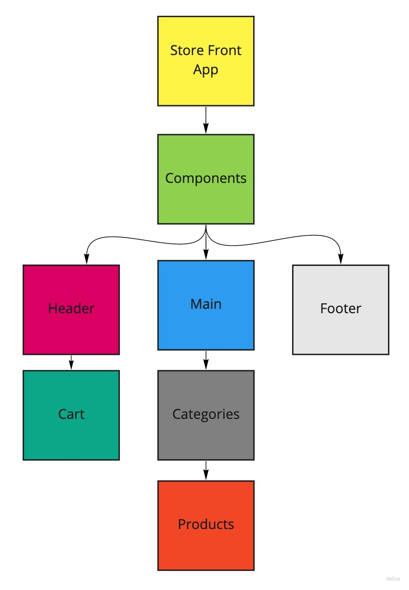

<h1 align="center">Welcome to Store Front 👋</h1>
<p>
  
  <a href="#" target="_blank">
    
  </a>
</p>

> An e-Commerce storefront using React with Redux.

## Deployed GitHub Page
[Apex Electronics](https://markjackson28.github.io/storefront/)

## Install

```sh
npm install
```

## Usage

```sh
npm run start
```

<!-- ## Run tests

```sh
npm run test
``` -->

## Author

👤 **Mark Thanadabouth**

## Collaborators

👤 **Lorenzo Ortega**

## UML



## Lab Requirements

### Phase 1: Application State with Redux

In this first phase, our goal is to setup the basic scaffolding of the application with initial styling and basic behaviors. This initial build sets up the file structure and state management so that we can progressively build this application in a scalable manner

The following user/developer stories detail the major functionality for this phase of the project.

- As a user, I expect to see a list of available product categories in the store so that I can easily browse products
- As a user, I want to choose a category and see a list of all available products matching that category
- As a user, I want a clean, easy to use user interface so that I can shop the online store with confidence

### Phase 2: Redux - Combined Reducers

In phase 2, we will be adding the “Add to Cart” feature to our application, which will allow our users to not only browse items in the store, but also select them and have them persist in their “shopping cart” for later purchase.

- As a user, I want to choose from products in the list and add them to my shopping cart
- As a user, I want to see the products that I’ve added to my shopping cart so that
- As a user, I want to change the quantity of items I intend to purchase in my shopping cart
- As a user, I want to be able to remove an item from my shopping cart

### Resources

- [How to deploy to gh-pages](https://medium.com/mobile-web-dev/how-to-build-and-deploy-a-react-app-to-github-pages-in-less-than-5-minutes-d6c4ffd30f14)
- [Redux Toolkit](https://redux-toolkit.js.org/)
- [Fetching data from an API using thunks [createAsyncThunk] - redux toolkit](https://www.youtube.com/watch?v=xtD4YMKWI7w)

## Show your support

Give a ⭐️ if this project helped you!

***
_This README was generated with ❤️ by [readme-md-generator](https://github.com/kefranabg/readme-md-generator)_
